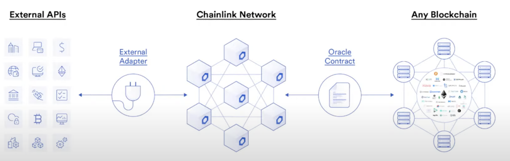

# chainlink-external-adapters

This is a workshop used to build an end-to-end DEMO that uses Chainlink Adapters from Chainlink Hackathon Spring 2022.
The workshop followed to complete this repo is [this one](https://www.youtube.com/watch?v=fICFYsN4E74&t=2527s).

Chainlink External Adapters allows to connect to APIs that are unreachable via de standard [HTTP task](https://docs.chain.link/docs/jobs/task-types/http/). That means that you can connect any API that is avaliable on the Internet to your Smart Contract by using Chainlink nodes through Chainlink external adapters.

- They way it work is like the one in the following figure:

## Resources
- [Chalink External Adapters](https://docs.chain.link/docs/external-adapters/): Chainlink external adapters documentation.
- [HTTP task](https://docs.chain.link/docs/jobs/task-types/http/): standard HTTP task documentation.